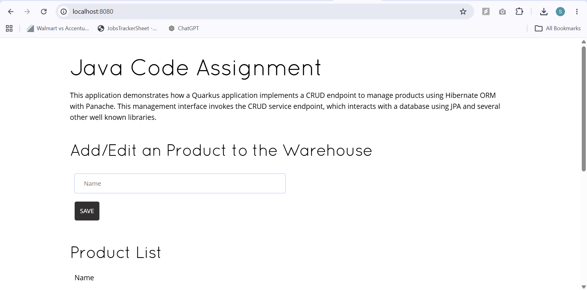
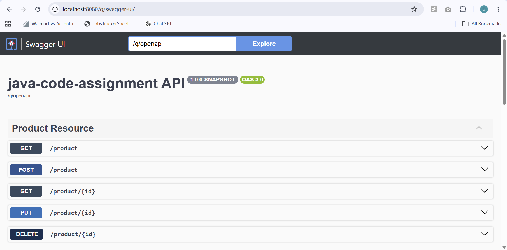
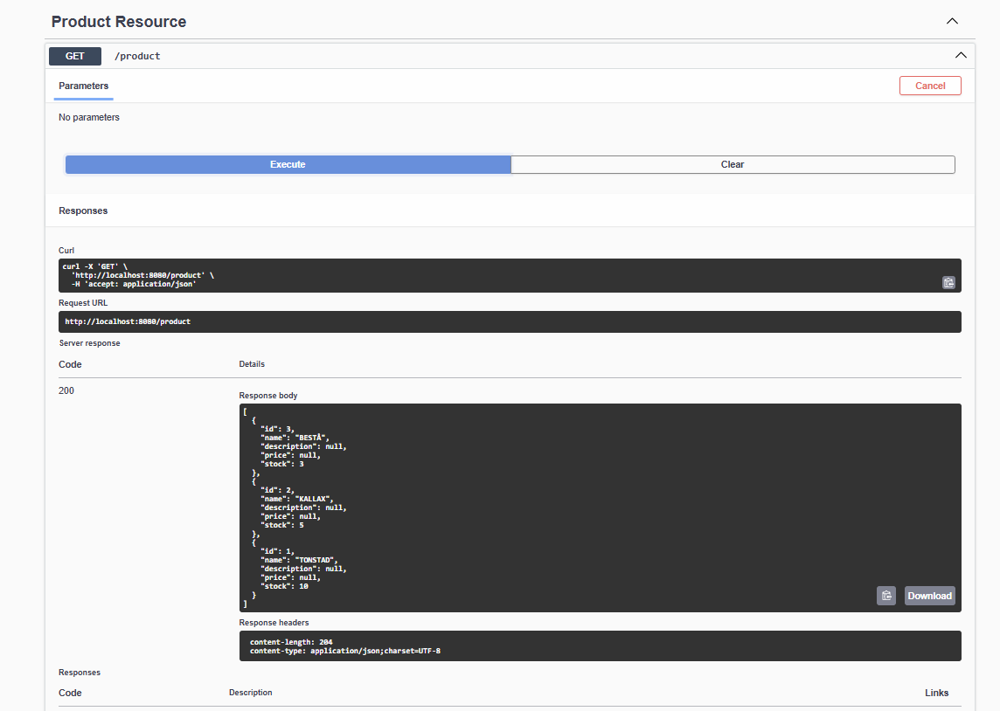
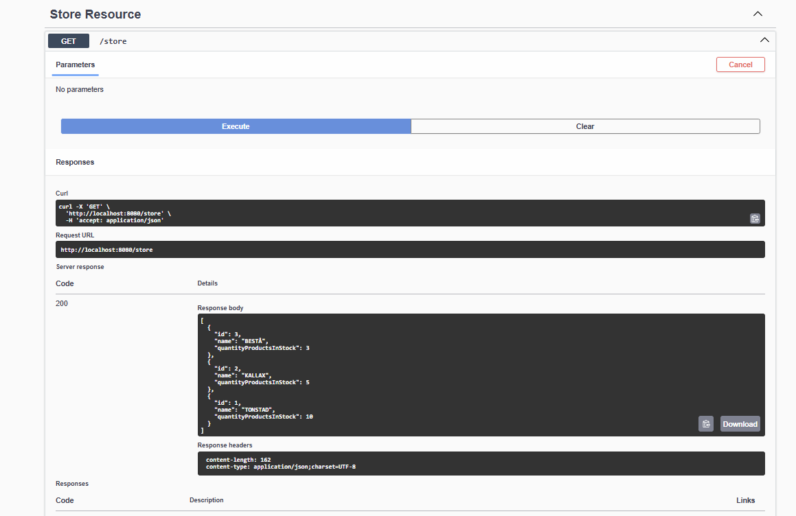
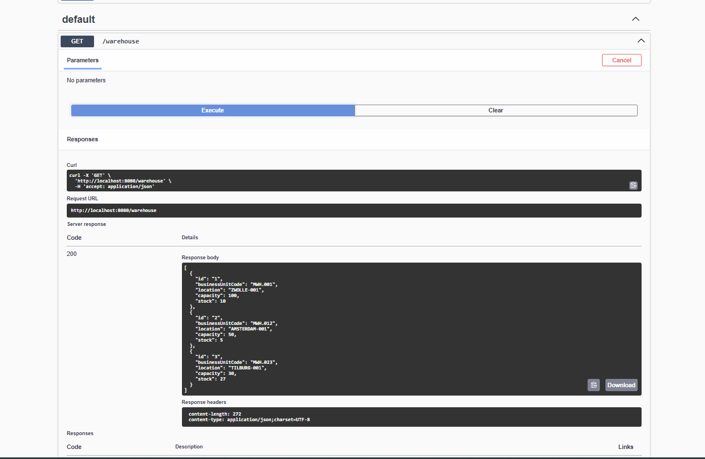
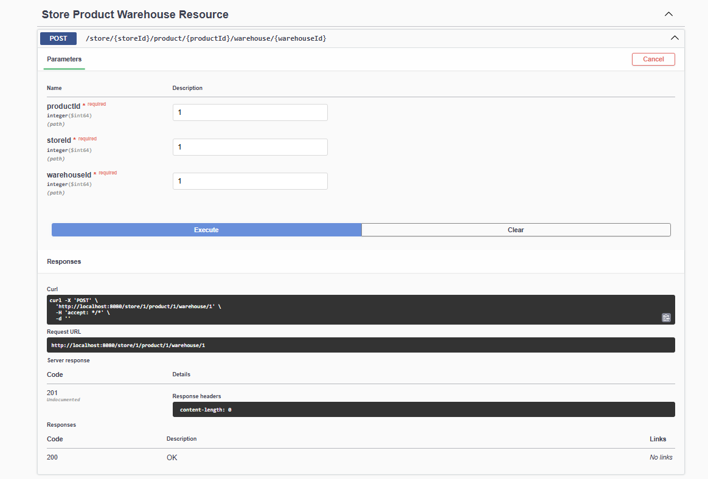
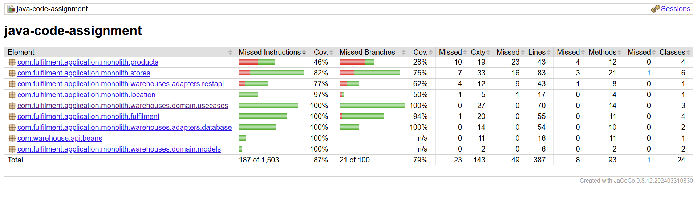
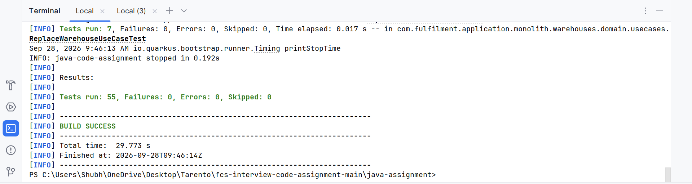

# Java Code Assignment

A Java 17 and Quarkus based application implementing REST APIs for Products, Stores, Warehouses, and Store-Product-Warehouse Fulfilment.

The application demonstrates REST API development, PostgreSQL persistence, business validation, transaction management, automated testing, API documentation, and a hexagonal architecture approach for the fulfilment functionality.

## Assignment Overview

The assignment focuses on implementing and extending an existing Java application with the following capabilities:

- Product management
- Store management
- Warehouse management
- Store-Product-Warehouse fulfilment association
- Business rule validation
- Database persistence using PostgreSQL
- Transaction handling
- Automated unit and integration testing
- API documentation using OpenAPI and Swagger UI
- Test coverage reporting using JaCoCo
- CI execution using GitHub Actions

The original assignment requirements are available in:

- [CODE_ASSIGNMENT](CODE_ASSIGNMENT.md)
- [CASE_STUDY](../case-study/CASE_STUDY.md)
- [QUESTIONS](QUESTIONS.md)

---

## Technology Stack

| Technology | Purpose |
|---|---|
| Java 17 | Application development |
| Quarkus | Backend framework |
| Maven | Build and dependency management |
| PostgreSQL | Relational database |
| Hibernate ORM / Panache | Persistence layer |
| JAX-RS | REST API development |
| JUnit 5 | Unit testing |
| REST Assured | API testing |
| Mockito | Mocking in unit tests |
| JaCoCo | Code coverage reporting |
| OpenAPI / Swagger UI | API documentation |
| Docker | PostgreSQL container and application support |
| GitHub Actions | Continuous Integration |

---

## Application Features

### Product

The Product functionality provides APIs for managing products and their associated information.

### Store

The Store functionality provides APIs for creating, reading, updating, patching, and deleting stores.

Store changes are synchronized with the downstream legacy store system using a transaction-aware CDI event observer. The legacy gateway is invoked only after the database transaction completes successfully.

### Warehouse

Warehouse management follows an adapter/domain-based structure with separate database, REST, domain model, port, and use-case components.

### Fulfilment

The fulfilment functionality associates a Product with a Store and a Warehouse.

The fulfilment implementation is organized using application, domain, and adapter layers following a hexagonal architecture approach

```text
fulfilment/
├── adapters/
│   ├── database/
│   │   ├── StoreProductWarehouse.java
│   │   └── StoreProductWarehouseRepository.java
│   └── restapi/
│       └── StoreProductWarehouseResource.java
├── application/
│   └── StoreProductWarehouseService.java
└── domain/
    ├── ports/
    │   └── StoreProductWarehouseStore.java
    └── validators/
        └── StoreProductWarehouseValidator.java
```
## Application Screenshots

### Application Home


### Swagger UI


### Product API


### Store API


### Warehouse API


### Fulfilment API


### Test Coverage


### Test Results
